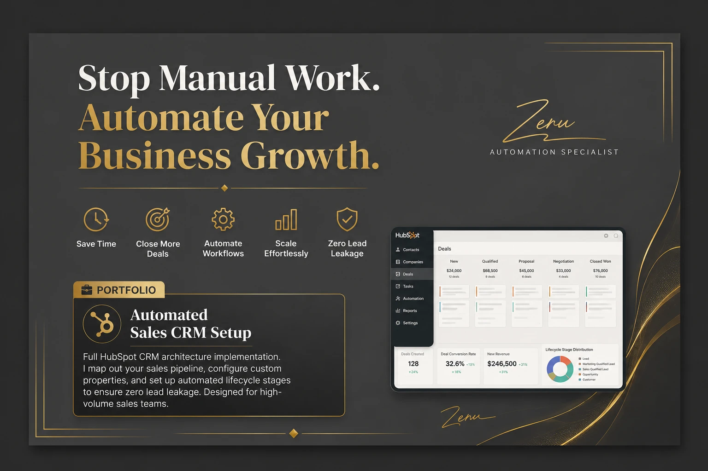
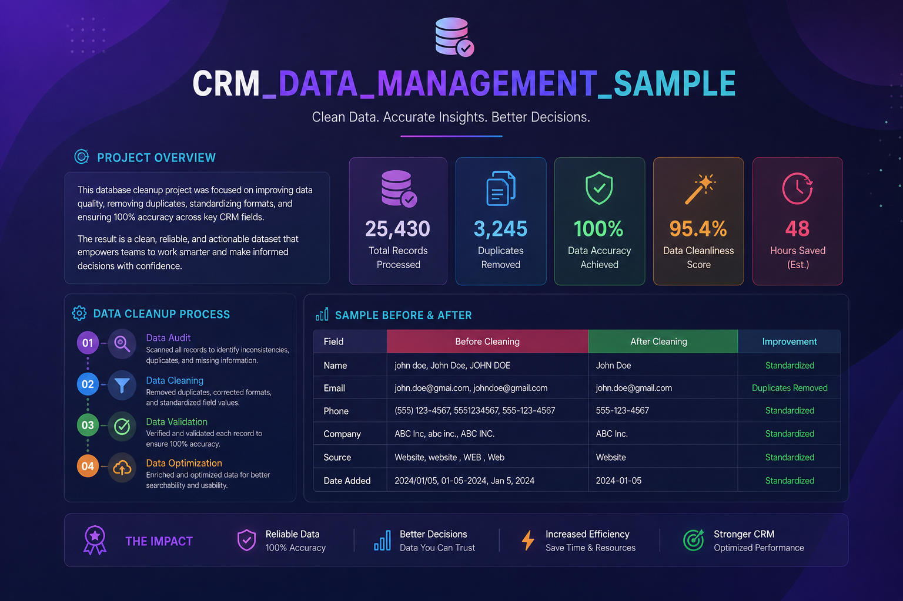
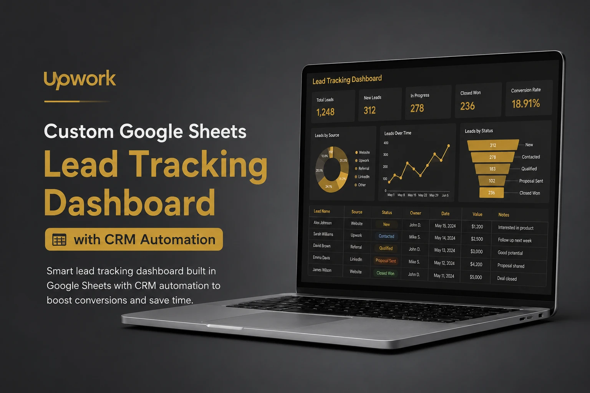

# CRM Lead Management & Automation Dashboard

## 📌 Project Overview
This project demonstrates professional CRM dashboards and KPI reporting solutions built with Google Sheets to automate reporting, monitor business performance, and improve decision-making.

## 🚀 Features
- CRM Lead Management
- KPI Dashboards
- Google Sheets Automation
- Data Cleaning
- Dynamic Charts
- Zapier Integration
- Gmail Automation
- Business Reporting

## 🛠️ Tools Used
- Google Sheets
- Google Workspace
- HubSpot
- Zapier
- n8n
- Google Apps Script

## 💼 Business Value
This solution helps businesses automate reporting, track KPIs, improve lead management, reduce manual work, and make faster business decisions.

## 📈 Results
- Automated KPI reporting
- Improved CRM workflow
- Faster business insights
- Reduced manual reporting

## 🎯 Skills Demonstrated
- CRM Management
- Dashboard Design
- Google Sheets Automation
- Data Cleaning
- Workflow Automation

## ⚙️ How It Works
1. Leads are collected from CRM or forms.
2. Data is cleaned and organized automatically.
3. KPI dashboards update dynamically.
4. Automated notifications are triggered.
5. Reports support business decisions.

## 🔄 Automation Workflow
Lead Source → CRM Database → Google Sheets → KPI Dashboard → Gmail Notifications → Business Reports

## 💼 Use Cases
- Small business CRM management
- Sales KPI monitoring
- Automated business reporting
- Lead tracking and follow-up
- Data cleaning and analysis

## 🧩 Challenges & Solutions
**Challenge:** Manual reporting was slow and repetitive.
**Solution:** Built automated dashboards and workflows to improve reporting speed and accuracy.

## 🚀 Future Improvements
- AI-powered lead scoring
- More HubSpot integrations
- Real-time analytics
- Advanced workflow automation

## 📸 Project Screenshots
### Automated Sales CRM Workflow

### CRM, Zapier, Gmail & KPI Dashboard
 
### CRM_Data_Management_Sample

### Custom Google Sheets Lead Tracking Dashboard

### Automated KPI Dashboard
.png)
### Smart Automation Hub

## 👨‍💻 About Me
I help businesses automate CRM workflows, reporting systems, and repetitive tasks using HubSpot, Google Sheets, Google Workspace, Zapier, Google Apps Script, and n8n.

**Upwork:** https://www.upwork.com/freelancers/~010472b5935fc59690
**Fiverr:** https://www.fiverr.com/zerihunabera413

## 👨‍💻 Author
**Zerihun Abera**

**CRM & Lead Automation Specialist
HubSpot | Google Sheets | Google Workspace | Zapier | n8n**
